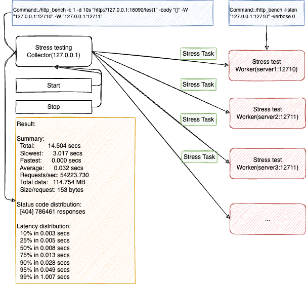

## a HTTP(HTTP/1, HTTP/2) stress test tool, support single and distributed.

http_bench is a tiny program that sends some load to a web application, support single and distributed mechine, http/1 and http/2.

[English Document](https://github.com/linkxzhou/http_bench/blob/master/README.md)  
[中文文档](https://github.com/linkxzhou/http_bench/blob/master/README_CN.md)  

- [x] HTTP/1 stress
- [x] HTTP/2 stress
- [x] Distributed stress
- [x] Support functions
- [ ] Support variable
- [ ] HTTP/3 stress
  
### Installation

```
go get github.com/linkxzhou/http_bench
```
OR
```
git clone git@github.com:linkxzhou/http_bench.git
cd http_bench
go build http_bench.go
```

### Architecture


### Basic Usage

```
./http_bench http://127.0.0.1:8000 -c 1000 -d 60s
Running 1000 connections, @ http://127.0.0.1:8000

Summary:
  Total:        63.031 secs
  Slowest:      0.640 secs
  Fastest:      0.000 secs
  Average:      0.072 secs
  Requests/sec: 12132.423
  Total data:   8.237 GB
  Size/request: 11566 bytes

Status code distribution:
  [200] 764713 responses

Latency distribution:
  10% in 0.014 secs
  25% in 0.030 secs
  50% in 0.060 secs
  75% in 0.097 secs
  90% in 0.149 secs
  95% in 0.181 secs
  99% in 0.262 secs
```

### Command Line Options

```
-n  Number of requests to run.
-c  Number of requests to run concurrently. Total number of requests cannot
  be smaller than the concurency level.
-q  Rate limit, in seconds (QPS).
-d  Duration of the stress test, e.g. 2s, 2m, 2h
-t  Timeout in ms.
-o  Output type. If none provided, a summary is printed.
  "csv" is the only supported alternative. Dumps the response
  metrics in comma-seperated values format.
-m  HTTP method, one of GET, POST, PUT, DELETE, HEAD, OPTIONS.
-H  Custom HTTP header. You can specify as many as needed by repeating the flag.
  for example, -H "Accept: text/html" -H "Content-Type: application/xml", 
  but "Host: ***", replace that with -host.
-http  Support HTTP/1 HTTP/2, default HTTP/1.
-body  Request body, default empty.
-a  Basic authentication, username:password.
-x  HTTP Proxy address as host:port.
-disable-compression  Disable compression.
-disable-keepalive    Disable keep-alive, prevents re-use of TCP
          connections between different HTTP requests.
-cpus                 Number of used cpu cores.
          (default for current machine is %d cores).
-url 		Request single url.
-verbose 	Print detail logs, default 2(0:TRACE, 1:DEBUG, 2:INFO ~ ERROR).
-url-file 	Read url list from file and random stress test.
-body-file  Request body from file.
-listen 	Listen IP:PORT for distributed stress test and worker mechine (default empty). e.g. "127.0.0.1:12710".
-W  Running distributed stress test worker mechine list.
      for example, -W "127.0.0.1:12710" -W "127.0.0.1:12711".
```

Example stress test for url(print detail info "-verbose 1"):
```
./http_bench -n 1000 -c 10 -m GET -url "http://127.0.0.1/test1"
./http_bench -n 1000 -c 10 -m GET "http://127.0.0.1/test1"
```

Example stress test for file(print detail info "-verbose 1"):
```
./http_bench -n 1000 -c 10 -m GET "http://127.0.0.1/test1" -url-file urls.txt
./http_bench -d 10s -c 10 -m POST -body "{}" -url-file urls.txt
```

Example stress test for http/2:
```
./http_bench -d 10s -c 10 -http http2 -m POST "http://127.0.0.1/test1" -body "{}"
```

Example distributed stress test(print detail info "-verbose 1"):
```
(1) First step:
./http_bench -listen "127.0.0.1:12710" -verbose 1
./http_bench -listen "127.0.0.1:12711" -verbose 1

(2) Second step:
./http_bench -c 1 -d 10s "http://127.0.0.1:18090/test1" -body "{}" -W "127.0.0.1:12710" -W "127.0.0.1:12711" -verbose 1
```

### Support Function and Variable

**(1) intSum**  
```
== Params: intSum number1 number2 number3 ...
== Client Request Example:
./http_bench -c 1 -n 1 "https://127.0.0.1:18090?data={{ intSum 1 2 3 4}}" -verbose 0
== Body Request Example:
./http_bench -c 1 -n 1 "https://127.0.0.1:18090" -body "data={{ intSum 1 2 3 4 }}" -verbose 0
```

**(2) random**  
```
== Params: random min_value max_value
== Client Request Example:
./http_bench -c 1 -n 1 "https://127.0.0.1:18090?data={{ random 1 100000}}" -verbose 0
== Body Request Example:
./http_bench -c 1 -n 1 "https://127.0.0.1:18090" -body "data={{ random 1 100000 }}" -verbose 0
```

**(3) randomDate**  
```
== Params: randomDate format(random date string: YMD = yyyyMMdd, HMS = HHmmss, YMDHMS = yyyyMMdd-HHmmss)
== Client Request Example:
./http_bench -c 1 -n 1 "https://127.0.0.1:18090?data={{ randomDate \"YMD\"}}" -verbose 0
== Body Request Example:
./http_bench -c 1 -n 1 "https://127.0.0.1:18090" -body "data={{ randomDate \"YMD\" }}" -verbose 0
```

**(4) randomString**  
```
== Params: randomString count(random string: 0123456789abcdefghijklmnopqrstuvwxyzABCDEFGHIJKLMNOPQRSTUVWXYZ)
== Client Request Example:
./http_bench -c 1 -n 1 "https://127.0.0.1:18090?data={{ randomString 10}}" -verbose 0
== Body Request Example:
./http_bench -c 1 -n 1 "https://127.0.0.1:18090" -body "data={{ randomString 10 }}" -verbose 0
```

**(5) randomNum**  
```
== Params: randomNum count(random string: 0123456789)
== Client Request Example:
./http_bench -c 1 -n 1 "https://127.0.0.1:18090?data={{ randomString 10}}" -verbose 0
== Body Request Example:
./http_bench -c 1 -n 1 "https://127.0.0.1:18090" -body "data={{ randomString 10 }}" -verbose 0
```

**(6) date**  
```
== Params: date format(YMD = yyyyMMdd, HMS = HHmmss, YMDHMS = yyyyMMdd-HHmmss)
== Client Request Example:
./http_bench -c 1 -n 1 "https://127.0.0.1:18090?data={{ date \"YMD\" }}" -verbose 0
== Body Request Example:
./http_bench -c 1 -n 1 "https://127.0.0.1:18090" -body "data={{ date \"YMD\" }}" -verbose 0
```

**(7) UUID**  
```
== Params: UUID
== Client Request Example:
./http_bench -c 1 -n 1 "https://127.0.0.1:18090?data={{ UUID | escape }}" -verbose 0
== Body Request Example:
./http_bench -c 1 -n 1 "https://127.0.0.1:18090" -body "data={{ UUID }}" -verbose 0
```

**(8) escape**  
```
== Params: escape str(pipeline with other functions)
== Client Request Example:
./http_bench -c 1 -n 1 "https://127.0.0.1:18090?data={{ UUID | escape }}" -verbose 0
== Body Request Example:
./http_bench -c 1 -n 1 "https://127.0.0.1:18090" -body "data={{ UUID | escape }}" -verbose 0
```